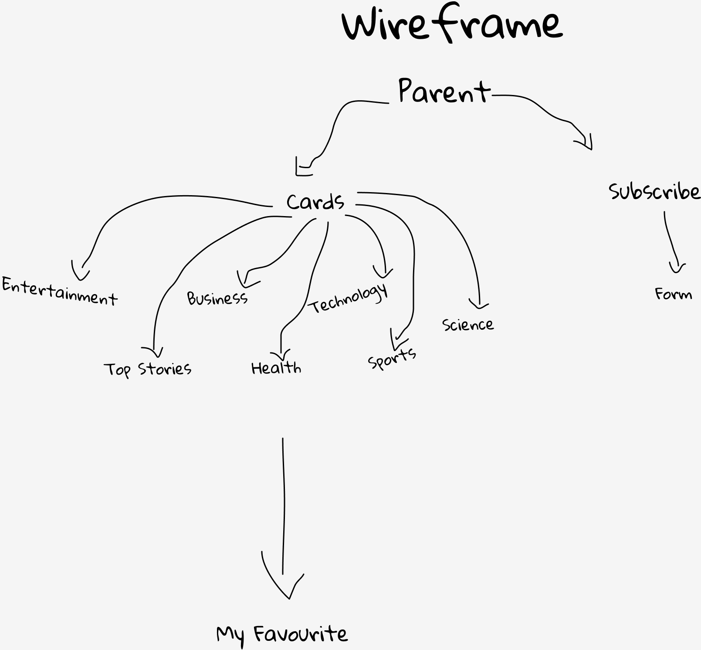

# News Website
:newspaper: A news web application that displays news with different categories. The user can subscribe to the website if they want to! The template was built with React and news API.

# Getting Started

For my wireframe, Figma was used to create the initial overview of the page structure, functionality and layout.

# Technical Used
- React
- Material UI
- Bootstrap
- urlcat
- axios for API
- Insomnia
- Semantic UI

# Development Process
1. Plan the overall view of the project.
2. Ensure that the API is working for my project. Start coding!
3. Keep testing and ensure that defects are recognized as soon as possible.
4. Deployment time.